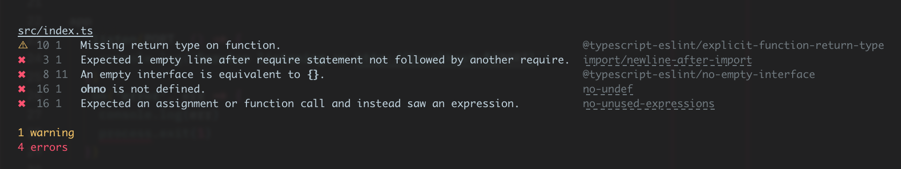

<h1 align="center">
  
</h1>
<br>

<div align="right">
  <!-- prettier-ignore-start -->
  <a href="https://www.npmjs.com/package/eslint-config-eloquence">
    
  </a>
  <a href="https://www.npmjs.com/package/eslint-config-eloquence">
    
  </a>
  <a href="https://github.com/crystal-ball/eslint-config-eloquence/actions?workflow=CI%2FCD">
    
  </a>
  <a href="https://snyk.io/test/github/crystal-ball/eslint-config-eloquence?targetFile=package.json">
    
  </a>
  <code>:status&nbsp;&nbsp;&nbsp;&nbsp;&nbsp;&nbsp;</code>

  <br />
  <a href="https://renovatebot.com/">
    
  </a>
  <a href="https://commitizen.github.io/cz-cli/">
    
  </a>
  <a href="https://github.com/crystal-ball/eslint-config-eloquence#workspaces/-projects-5b88b5c9af3c0a2186966767/board?repos=90155935">
    
  </a>
  <a href="https://semantic-release.gitbook.io/semantic-release/">
    
  </a>
  <a href="./CODE_OF_CONDUCT.md">
    
  </a>
  <code>:integrations</code>

  <br />
  <a href="https://github.com/crystal-ball">
    
  </a>
  <a href="https://github.com/crystal-ball/crystal-ball.github.io">
    
  </a>
  <code>:flair&nbsp;&nbsp;&nbsp;&nbsp;&nbsp;&nbsp;&nbsp;</code>
  <!-- prettier-ignore-end -->
</div>

---

Eloquence is a robust and adaptive ESLint configuration set for code linting
code quality, style and formatting.

- 🔋 Manages all ESLint dependencies for simple setup and version maintenance
- 🧐 Intelligently adjusts error severity for style and formatting rules for
  development workflows
- 😲 Smartly overrides configurations for Storybook, Cypress, webpack and Jest
  files.
- ✅ React Testing Library and Jest DOM rules
- 😍 Fully integrated with linting for Prettier formatting
- 🌲 Includes Cypress tests specific ruleset
- 👮‍♀️ Supports linting TypeScript projects

The most important opinion of Eloquence is that linters shouldn't get in your
way while developing, so outside test environments all rules related to styling
are downgraded to warnings and all formatting rules are silenced. See
[Rules](#rules) for details.

## ⚙️ Setup

#### Install Dependencies

```sh
# All projects:
npm i eslint-config-eloquence prettier -D

# React projects using webpack
npm i eslint-import-resolver-webpack -D

# TypeScript projects
npm i @typescript-eslint/eslint-plugin @typescript-eslint/parser -D
```

_We recommend adding [Prettier][] as an exact version project dependency to
ensure all contributors are using the same version of Prettier, while still
allowing projects to update Prettier versions on their own schedule._

#### Configure ESLint

```javascript
// .eslintrc.js
'use strict'

const eloquence = require('eslint-config-eloquence')

module.exports =  = eloquence({ target: 'react|node' })
```

Eloquence supports Node.js services and React applications using the `target`
configuration.

- Pass `'node'` - for Node services and NPM packages
- Pass `'react'` - for React applications bundled with webpack

#### Pretty print output

The [`eslint-formatter-pretty`][] package is included in the dependencies and
can be used to output pretty formatted results. The pretty printed results
include hyperlinks to the rule docs and the files.

```
eslint --format=pretty src
```



## ⚙️ Imports customizations

Repositories can configure custom rules to enforce some common requirements:

- Restrict importing a specific module by setting a `no-restricted-imports`
  value. This can be useful for things like preventing React Router's Link
  component from being used instead of an application Link component.
- Restrict where certain modules can be imported by setting an
  `import/no-restricted-paths` value. This can be useful for enforcing
  boundaries between modules, like separating Electron client code from main
  code, or for enforcing that an index file is used for a component library
  directory

## 👩‍🏫 Rules

The Eloquence ruleset balances providing a rigorous, comprehensive ruleset with
providing only valuable linting messaging during non-test workflows. A
comprehensive ruleset helps people contribute to projects by programatically
answering questions about the code conventions expected by a project. However a
comprehensive ruleset can also be really noisy and problematically irritating.
To solve this issue Eloquence intelligently adjusts the linter error level for
rule types by environment:

#### Error levels

| Env  | Quality rules | Style rules | Formatting rules |
| ---- | ------------- | ----------- | ---------------- |
| Test | `error`       | `error`     | `error`          |
| Dev  | `error`       | `warn`      | `off`            |

This means linting related to code quality is always surfaced as a priority, but
during development non critical feedback related to code style and formatting is
moderated.

#### Linting philosphy

In general, the Eloquence ruleset tries to encourage these coding practices:

- Readable, explicit code is always preferred over clever code.
- Premature abstraction leads to more issues than duplicated code.
- Whenever possible try to write simple code that can be read through without
  puzzle solving.

## 👮‍♀️ TypeScript

TypeScript rules are supported out of the box for React and Node configurations
using an `override`. Projects using TS must install
`@typescript-eslint/eslint-plugin` and `@typescript-eslint/parser` and provide a
`tsconfig` in the project root.

#### VSCode

By default the ESLint extension for VSCode is only configured to lint JS
language files and you need to add the TypeScript and TypeScript+React languages
if you haven't.

```json
{
  "eslint.validate": [
    "javascript",
    "javascriptreact",
    "typescript",
    "typescriptreact"
  ]
}
```

## File overrides

Eloquence overrides the base project rules and settings for specific file
patterns to eliminate the need for ESLint configuration comments:

| Files                 | Updates                        |
| --------------------- | ------------------------------ |
| `['*.ts', '*.tsx']`   | TypeScript rules enabled       |
| `['*.spec.js']`       | Adds Jest globals              |
| `['cypress/**/*']`    | Adds Cypress globals and rules |
| `['.storybook/**/*']` | Support ESmodules              |

Finally, configuration files for Storybook, Cypress, Babel, Jest, and webpack
are all set to CommonJS modules with Node globals for configuring tooling
executed by Node.js.

## 🔋 Batteries included

This package will automatically include all of the packages needed to run
ESLint. Projects should allow this package to "own" the dependency management
for packages related to ESLint. _(When possible ensure that the only version of
`eslint` and `babel-eslint` included in a project are the versions specified by
this package.)_

#### Included dependencies:

- [`eslint`][]
- [`babel-eslint`][]
- [`eslint-config-prettier`][]
- [`eslint-plugin-cypress`][]
- [`eslint-plugin-import`][]
- [`eslint-plugin-jest-dom`][]
- [`eslint-plugin-jsx-a11y`][]
- [`eslint-plugin-prettier`][]
- [`eslint-plugin-react`][]
- [`eslint-plugin-react-hooks`][]
- [`eslint-plugin-testing-library`][]
- [`eslint-formatter-pretty`][]

## 😍 Contributing

This is an open source project that welcomes and appreciates contributions from
everyone 🎉. <br /> Please read the [Code of Conduct](./CODE_OF_CONDUCT.md) and
[Contributing](./.github/CONTRIBUTING.md) guides to get started.

## Thank You!

- The base ESLint rules for this project began with the Airbnb ESLint
  configuration and have evolved to the current rule definitions.

<!-- Links -->

<!-- prettier-ignore-start -->
[`@typescript-eslint/eslint-plugin`]:https://github.com/typescript-eslint/typescript-eslint/tree/master/packages/eslint-plugin
[`@typescript-eslint/parser`]:https://github.com/typescript-eslint/typescript-eslint/tree/master/packages/parser
[`babel-eslint`]:https://github.com/babel/babel-eslint
[`eslint-config-prettier`]:https://github.com/prettier/eslint-config-prettier
[`eslint-formatter-pretty`]:https://github.com/sindresorhus/eslint-formatter-pretty
[`eslint-import-resolver-webpack`]:https://github.com/benmosher/eslint-plugin-import/tree/master/resolvers/webpack
[`eslint-plugin-cypress`]:https://github.com/cypress-io/eslint-plugin-cypress
[`eslint-plugin-import`]:https://github.com/benmosher/eslint-plugin-import
[`eslint-plugin-jest-dom]:https://github.com/testing-library/eslint-plugin-jest-dom
[`eslint-plugin-jsx-a11y`]:https://github.com/evcohen/eslint-plugin-jsx-a11y
[`eslint-plugin-prettier`]:https://github.com/prettier/eslint-plugin-prettier
[`eslint-plugin-react`]:https://github.com/yannickcr/eslint-plugin-react
[`eslint-plugin-react-hooks`]:https://github.com/facebook/react/tree/master/packages/eslint-plugin-react-hooks
[`eslint-plugin-testing-library]:https://github.com/testing-library/eslint-plugin-testing-library
[`eslint`]:https://eslint.org/
[`typescript`]:https://github.com/Microsoft/TypeScript
[prettier options]:https://prettier.io/docs/en/options.html
[prettier]:https://prettier.io/
<!-- prettier-ignore-end -->
